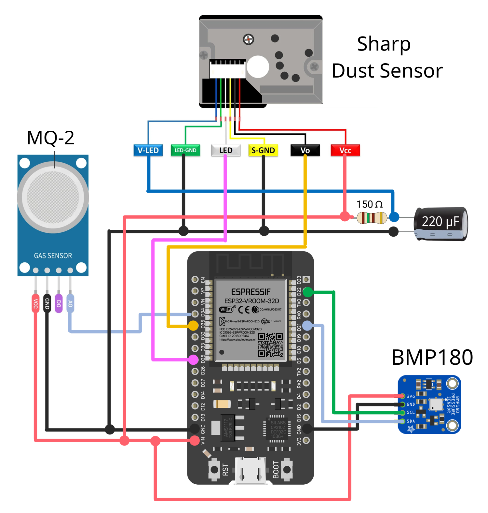

# Medidor de Calidad de Aire


Repositorio del proyecto **Medidor de Calidad de Aire**, desarrollado en el marco de la materia *Laboratorio de Sistemas Embebidos* de la carrera Ingeniería en Computación (UNRN).

El trabajo propone un dispositivo embebido de bajo costo para el monitoreo **indicativo** de contaminantes en zonas cercanas al vertedero municipal de San Carlos de Bariloche. Busca ofrecer alerta temprana, concientización ambiental y un registro histórico accesible para los vecinos de la zona.

## Advertencia importante

Este proyecto:

- Tiene fines exclusivamente académicos.
- Se encuentra en desarrollo y no representa un producto final.

## Tabla de contenidos

- [Descripción general](#descripción-general)
- [Características principales](#características-principales)
- [Hardware necesario](#hardware-necesario)
- [Software y dependencias](#software-y-dependencias)
- [Instalación y configuración](#instalación-y-configuración)
- [Formato de datos](#formato-de-datos)
- [Uso](#uso)
- [Estructura del repositorio](#estructura-del-repositorio)
- [Estado actual y próximos pasos](#estado-actual-y-próximos-pasos)
- [Licencia](#licencia)
- [Referencias](#referencias)

## Descripción general

El sistema consiste en una unidad de adquisición de datos ambientales basada en **ESP32**, capaz de medir:

- **Material particulado** mediante el sensor óptico Sharp GP2Y1014AU0F.
- **Gases combustibles y humo** mediante el sensor MQ-2.
- **Temperatura y presión atmosférica** mediante el sensor BMP180.

Las lecturas se envían a **Firebase Realtime Database** y se visualizan a través de una **aplicación web progresiva (PWA)** alojada en la carpeta `docs/`. La interfaz muestra los valores actuales, gráficos históricos, semáforos de alerta y notificaciones del navegador.

## Características principales

- Lectura periódica de sensores.
- Conexión WiFi con **portal cautivo** integrado para configuración sin hardcodear credenciales.
- Envío de registros a Firebase con marca de tiempo automática.
- **PWA** responsive con:
  - Visualización de temperatura, presión, MQ-2 y Sharp.
  - Gráficos de evolución con rangos de 15 minutos, 1 hora y 24 horas.
  - Semáforos de alerta para MQ-2 y Sharp.
  - Notificaciones del navegador ante niveles críticos.
  - Código QR para acceso rápido desde dispositivos móviles.
  - Soporte para instalación como aplicación en el escritorio o móvil.
- Reintentos automáticos de conexión WiFi ante desconexiones.
- Código modular organizado en sensores y servicios.

## Hardware necesario

### Componentes principales

| Componente | Descripción |
|------------|-------------|
| ESP32 DevKit v1 | Microcontrolador principal con WiFi |
| BMP180 | Sensor de temperatura y presión (I2C) |
| MQ-2 | Sensor de gases combustibles y humo |
| Sharp GP2Y1014AU0F | Sensor óptico de material particulado |
| Resistencias, transistor, capacitor | Circuito de manejo del LED del Sharp (ver datasheet) |
| Fuente de alimentación | Cable USB o batería LiPo con protección |

### Diagrama de conexiones



> Para más detalles sobre el cableado, consultar [`docs/CABLEADO.md`](docs/CABLEADO.md).

### Tabla de pines (ESP32)

| Sensor | Pin ESP32 | Notas |
|--------|-----------|-------|
| BMP180 SDA | GPIO21 | I2C |
| BMP180 SCL | GPIO22 | I2C |
| MQ-2 AOUT | GPIO34 | ADC, entrada 0-3.3 V |
| Sharp Vo | GPIO35 | ADC, entrada 0-3.3 V |
| Sharp LED control | GPIO25 | A través de circuito de manejo, activo en bajo |
| Botón BOOT | GPIO0 | Mantener 3 s para abrir portal cautivo |

## Software y dependencias

### Entorno de desarrollo

- [Arduino IDE](https://www.arduino.cc/en/software) o [PlatformIO](https://platformio.org/)
- Soporte para placas ESP32 en Arduino (`esp32` by Espressif Systems)

### Bibliotecas de Arduino requeridas

- `Adafruit BMP085` (driver del BMP180)
- `FirebaseESP32` (comunicación con Firebase)
- `WiFi`, `WebServer`, `DNSServer`, `Preferences` (incluidas en el core ESP32)

### Tecnologías de la interfaz web

- HTML5 + CSS3 + JavaScript vanilla
- [Chart.js](https://www.chartjs.org/) para gráficos
- [QRCode.js](https://github.com/davidshimjs/qrcodejs) para generación de QR
- Service Worker para funcionamiento offline como PWA

## Instalación y configuración

### 1. Clonar el repositorio

```bash
git clone https://github.com/albanogiovanni/medidor-calidad-aire-esp32.git
cd medidor-calidad-aire-esp32
```

### 2. Configurar credenciales de Firebase

Copiar el archivo de ejemplo y completar con los datos de tu proyecto:

```bash
cp firmware/esp32/medidor_calidad_aire/keys.example.h firmware/esp32/medidor_calidad_aire/keys.h
```

Editar `keys.h`:

```cpp
#define FIREBASE_HOST "https://tu-proyecto-default-rtdb.firebaseio.com"
#define FIREBASE_AUTH "TU_TOKEN_O_SECRET"
```

### 3. Compilar y cargar el firmware

Abrir en Arduino IDE:

```text
firmware/esp32/medidor_calidad_aire/medidor_calidad_aire.ino
```

Seleccionar la placa **ESP32 Dev Module**, el puerto correspondiente y subir el sketch.

### 4. Configurar WiFi

Al encender por primera vez, el ESP32 creará un punto de acceso llamado `CalidadAire-Config`. Conectarse y seguir las instrucciones del portal cautivo para ingresar las credenciales de la red WiFi.

Para reabrir el portal en cualquier momento, mantener presionado el botón **BOOT** (GPIO0) durante 3 segundos.

### 5. Desplegar la aplicación web

La interfaz de usuario se encuentra en `docs/index.html` y puede publicarse fácilmente con **GitHub Pages**:

1. Ir a **Settings > Pages** del repositorio.
2. Seleccionar la rama y la carpeta `/docs` como origen.
3. Guardar y esperar a que se genere la URL.

La URL será similar a:

```text
https://albanogiovanni.github.io/medidor-calidad-aire-esp32/
```

> Asegurarse de que las reglas de Firebase permitan lectura pública o autenticación adecuada para la URL desde donde se accede a la PWA.

## Formato de datos

Cada lectura se almacena como un objeto JSON bajo el nodo `/historial_sensores` de Firebase Realtime Database:

```json
{
  "bmp180_ok": true,
  "temperatura_c": 18.50,
  "presion_pa": 101325.00,
  "mq2_voltaje": 0.823,
  "sharp_voltaje": 0.412,
  "timestamp": 1715942400000
}
```

| Campo | Tipo | Descripción |
|-------|------|-------------|
| `bmp180_ok` | bool | Indica si el BMP180 respondió correctamente |
| `temperatura_c` | float | Temperatura ambiente en °C |
| `presion_pa` | float | Presión atmosférica en Pa |
| `mq2_voltaje` | float | Voltaje de salida del MQ-2 |
| `sharp_voltaje` | float | Voltaje de salida del Sharp |
| `timestamp` | int | Marca de tiempo generada por Firebase (milisegundos) |

## Uso

### Operación del dispositivo

Una vez configurado el WiFi, el ESP32:

1. Se conecta a la red configurada.
2. Lee los sensores.
3. Envía los datos a Firebase.
4. Reintenta la conexión automáticamente si se pierde.

### Visualización de datos

Acceder a la PWA desplegada. La interfaz muestra:

- **Tarjetas** con los últimos valores recibidos.
- **Semáforos** para MQ-2 y Sharp con los siguientes umbrales orientativos:

- **Gráficos** históricos filtrables por 15 minutos, 1 hora o 24 horas.
- **Tabla** con las últimas 20 lecturas.
- **Notificaciones** del navegador cuando algún sensor pasa a nivel rojo.

### Mantenimiento básico

- Recargar o alimentar el dispositivo periódicamente.
- Limpiar externamente la carcasa y asegurar que las entradas de aire no estén obstruidas.
- Verificar que los sensores no estén expuestos directamente a lluvia o nieve.

## Estructura del repositorio

```text
.
├── README.md
├── LICENSE
├── .gitignore
├── firmware/
│   └── esp32/
│       └── medidor_calidad_aire/
│           ├── medidor_calidad_aire.ino   # Firmware principal
│           ├── Config.h                   # Pines y parámetros
│           ├── keys.example.h             # Plantilla de credenciales
│           ├── src/
│           │   ├── sensors/               # Drivers de sensores
│           │   │   ├── BMP180Sensor.h/.cpp
│           │   │   ├── MQ2Sensor.h/.cpp
│           │   │   └── SharpSensor.h/.cpp
│           │   └── services/              # WiFi y Firebase
│           │       ├── WifiManager.h/.cpp
│           │       └── FirebaseService.h/.cpp
├── docs/
│   ├── index.html                         # Aplicación web (PWA)
│   ├── manifest.json                      # Manifiesto de la PWA
│   ├── sw.js                              # Service Worker
│   ├── CABLEADO.md                        # Guía de cableado
│   └── informes/                          # Documentación académica
│       ├── 01_Informe_de_Viabilidad.pdf
│       ├── 02_Informe_de_Requerimientos.pdf
│       └── 03_Informe_de_Planificacion.pdf
└── assets/
    └── img/                               # Diagramas y fotos del prototipo
```

## Estado actual y próximos pasos

### Funcionalidades implementadas

- [x] Firmware modular para ESP32.
- [x] Lectura de sensores BMP180, MQ-2 y Sharp GP2Y1014AU0F.
- [x] Conexión WiFi con portal cautivo.
- [x] Envío de datos a Firebase Realtime Database.
- [x] Aplicación web progresiva con gráficos, semáforos y alertas.
- [x] Reintentos automáticos de conexión.

### Pendientes y mejoras futuras

- [ ] Calibración de sensores y conversión a unidades físicas (por ejemplo, µg/m³ para material particulado).
- [ ] Definición de umbrales de alerta basados en referencias técnicas o normativas.
- [ ] Diseño e impresión de carcasa protectora para uso exterior.
- [ ] Evaluación de autonomía con batería LiPo y optimización de consumo.
- [ ] Verificación y procedimiento de calibración periódica.

## Licencia

Este proyecto se distribuye bajo la licencia MIT. Ver el archivo [`LICENSE`](LICENSE) para más detalles.

## Referencias

- Documentación académica del proyecto en `docs/informes/`.
